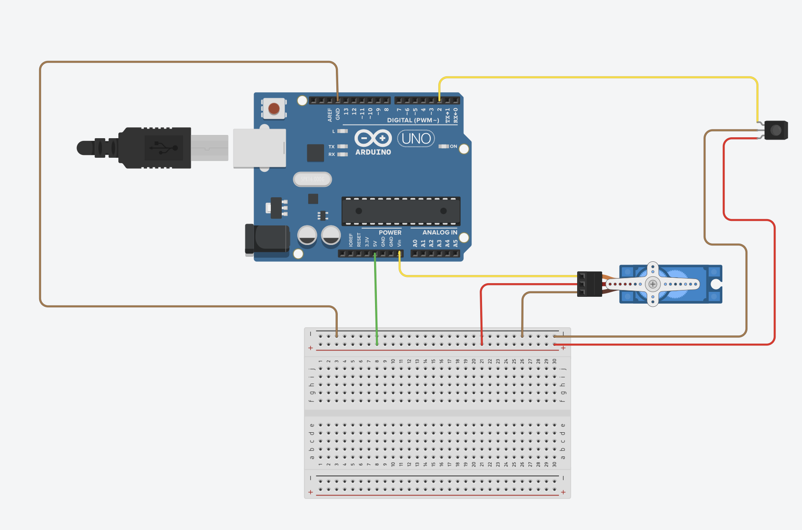
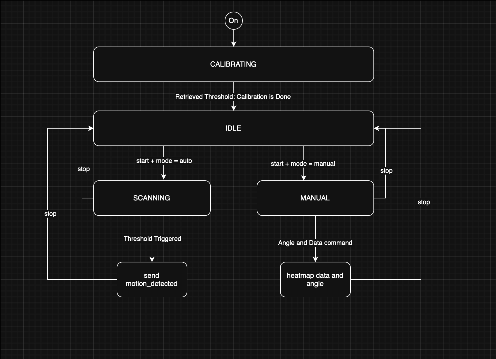

# Scanning IR Camera

## User Story

This will use an 8x8 pixel Infrared Camera Sensor

a.) Test pans and get base heat signature of the room, and reset to origin position. Calibrate over multiple pans and over a minute or two to get proper values.
b.) System start message, heat signature json request, left or right command to move the camera to a specific location.
c.) Changes from the calibration heat signature. Taking 20 seconds to do a full loop from left to right and back to left. Only notify when a threshold has been met that is not just noise in the system.

This will be implemented in the embedded/scanning_ir_camera folder.

The hardware for this will be a servo for scanning, and this 8x8 Thermal Camera: https://learn.adafruit.com/adafruit-amg8833-8x8-thermal-camera-sensor/overview

https://github.com/ComputerScienceUniversityofDenver/S25-EmbeddedSecuritySystem/issues/13

## Table of Contents

- [Configuration Parameters](#configuration-parameters)
- [Input Messages](##input-messages)
- [Output Messages](#output-messages)
- [Hardware Connections](#hardware-connections)
- [Software Design](#software-design)
- [Test Cases](#test-cases)

## Configuration Parameters

| Name                  | Type   | Description                                                                                                                                   |
| --------------------- | ------ | --------------------------------------------------------------------------------------------------------------------------------------------- |
| `calibration_time_ms` | int    | Duration used to calibrate the room’s baseline thermal signature and set the threshold. default: `36000`. Range: `1000-100000`.               |
| `sample_rate_ms`      | int    | Time for the camera to sample, `sample_rate_ms * 180` will give you time for a scan from `0-180` degrees. Default: `100`. Range: `100-10000`. |
| `manual_threshold`    | float  | Threshold for manual mode that triggers a motion alert. default: `25.0`. Range: `1.0-50.0`.                                                   |
| `mode`                | string | Operational mode: `"auto"` or `"manual"`. Default: `"auto"`.                                                                                  |
| `manual_angle`        | int    | Angle (degrees) used in manual mode for measurement. Default `90`. Range: `0–180`.                                                            |
| `frequency_rate_ms`   | int    | Rate at which `scanning_ir_camera.motion_detected` JSON messages are sent. Default `1000`. Range `500-10000`.                                 |
| `smoothing_amount`    | float  | Amount to smooth IR camera average value by. Default `2.0`. Range `0.0-10.0`.                                                                 |

**What these parameters may look like:**

- `{ "mtype": "config", "from": "*", "to":"scanning_ir_camera1", "name": "calibration_time_ms", "value": 2000 }`
- `{ "mtype": "config", "from": "*", "to":"scanning_ir_camera1", "name": "sample_rate_ms", "value": 200 }`
- `{ "mtype": "config", "from": "*", "to":"scanning_ir_camera1", "name": "manual_threshold", "value": 20.0 }`
- `{ "mtype": "config", "from": "*", "to":"scanning_ir_camera1", "name": "mode", "value": "manual" }`
- `{ "mtype": "config", "from": "*", "to":"scanning_ir_camera1", "name": "manual_angle", "value": 45 }`
- `{ "mtype": "config", "from": "*", "to":"scanning_ir_camera1", "name": "frequency_rate_ms", "value": 2000 }`
- `{ "mtype": "config", "from": "*", "to":"scanning_ir_camera1", "name": "smoothing_amount", "value": 3.0 }`

## Input Messages

| mtype                     | Name         | Description                                                                |
| ------------------------- | ------------ | -------------------------------------------------------------------------- |
| `scanning_ir_camera.scan` | `start`      | Command to bring the module from `idle` mode into `manual` or `auto` mode. |
| `scanning_ir_camera.scan` | `stop`       | Command to bring the module from `manual` or `auto` mode to `idle` mode.   |
| `scanning_ir_camera.get`  | `heatmap`    | Command to retrieve current heatmap from IR camera.                        |
| `scanning_ir_camera.get`  | `average_ir` | Command to retrieve current average_IR value from IR camera.               |
| `scanning_ir_camera.get`  | `angle`      | Command to retrieve current angle of the IR camera.                        |

**What these parameters may look like:**

- `{ "mtype": "scanning_ir_camera.scan", "from": "*", "to":"scanning_ir_camera1", "name": "start"}`
- `{ "mtype": "scanning_ir_camera.scan", "from": "*", "to":"scanning_ir_camera1", "name": "stop"}`
- `{ "mtype": "scanning_ir_camera.get", "from": "*", "to":"scanning_ir_camera1", "name": "heatmap" }`
- `{ "mtype": "scanning_ir_camera.get", "from": "*", "to":"scanning_ir_camera1", "name": "average_ir" }`
- `{ "mtype": "scanning_ir_camera.get", "from": "*", "to":"scanning_ir_camera1", "name": "angle" }`

## Output Message

All `scanning_ir_camera.out` are linked to `scanning_ir_camera.get` input messages.

| mtype                                | Name                                                             | Type          | Description                                                                           |
| ------------------------------------ | ---------------------------------------------------------------- | ------------- | ------------------------------------------------------------------------------------- |
| `scanning_ir_camera.out`             | `heatmap`                                                        | float[64]     | Sends current heatmap.                                                                |
| `scanning_ir_camera.out`             | `average_ir`                                                     | float         | Sends current average_ir reading.                                                     |
| `scanning_ir_camera.out`             | `angle`                                                          | int           | Sends current angle of servo.                                                         |
| `scanning_ir_camera.motion_detected` | `motion_detected`                                                | int           | Sends that motion was detected (`average_IR` breaks threshold) at the angle provided. |
| `debug`                              | `finished_calibrating`, `successful_command`, `JSON_debug`, etc. | float, String | Sends messages that are not vital to module interaction.                              |
| `error`                              | `JSON_error`, `Servo_error`, `IR_camera_error`, etc.             | String        | Sends error messages.                                                                 |

**What these parameters may look like:**

- `{ "mtype": "scanning_ir_camera.out", "from":"scanning_ir_camera1", "to": "*", "name":"heatmap", "value":[...float64...]}`
- `{ "mtype": "scanning_ir_camera.out", "from":"scanning_ir_camera1", "to": "*", "name":"average_ir" : "value":22.5}`
- `{ "mtype": "scanning_ir_camera.out", "from":"scanning_ir_camera1", "to": "*", "name":"angle" : "value":90}`
- `{ "mtype": "scanning_ir_camera.motion_detected", "from":"scanning_ir_camera1", "to": "*", "name":"motion_detected", "value":108}`
- `{ "mtype": "debug", "from":"scanning_ir_camera1", "to": "*", "name":"finished_calibrating", "message":26.3}`
- `{ "mtype": "error", "from":"scanning_ir_camera1", "to": "*", "name":"JSON_error", "message": "Error: invalid "JSON" value" }`

## Hardware Connections

The basic functionality of this module is using a servo motor and an IR camera to collect data by scanning a room. The servo motor is connected to the ESP32 with three wires: Vcc, GND, and PWM (to determine servo's angle). The IR camera (AMG8833) is connected with four wires: Vin, GND, SDA(I2C), and SCL(I2C).

[**AMG8833 IR Camera:**](https://learn.adafruit.com/adafruit-amg8833-8x8-thermal-camera-sensor/overview)

| Pin on Board | Description              |
| ------------ | ------------------------ |
| Vin -> 5v    | Powers the camera        |
| GND -> GND   | Shared ground connection |
| SDA -> D4    | I2C data line            |
| SCL -> D5    | I2C clock line           |

**Servo Motor:**

| Pin on Servo      | Description              |
| ----------------- | ------------------------ |
| Vcc(red) -> 5v    | Powers the servo         |
| GND(brown) -> GND | Shared ground connection |
| PWM(orange) -> D6 | PWM signal               |

We will be using the same microcontroller we've been using in class.
All hardware choices support the feature goals (servo panning, IR detection).

**Test Sketch (hello.ino):**

In this program, the servo sweeps from `s_origin_deg` and `s_max_deg` using `move_servo_to_from(int servo_origin_deg, int servo_max)` and the ability to move to a specific angle with `move_servo_to_deg(int deg)`. The IR camera (AMG8833) is implemented so that it can successfully calibrate to room temperature, get the 64 element array (`float*`) representing the 8x8 thermal image, and decide if something is detected to prove functionality of the camera. The whole system moves at `10Hz` because that is the max speed of the IR camera.

**Challenges and Pitfalls:**

The biggest challenge of this was understanding how the camera (AMG8833) and how the `adafruit_AMG88xx` library works. This library was extremely plug and play, I was able to get readings from it fairly quickly, I didn't even have to set the pins for the camera. This meant that I had to dive into the library to understand how the camera was functioning. Another challenge is that this program requires a loop. I needed a loop with a fixed iteration count of `64` in order to obtain each value from the 8x8 thermal image to get the average and put in a string.

**Wiring Diagram of Design:**

Does not show for diagram:

SCL -> D5

SDA -> D4

On board from IR camera pins


## Software Design

**States:**

- `IDLE` -> Waiting for start command (starts in `IDLE`)
- `CALIBRATING` -> Calibrates threshold for `auto`/`SCANNING` mode
- `SCANNING` -> Pans automatically and checks for breaches to calibrated threshold
- `MANUAL` -> Holds `manual_angle` and checks for breaches to `manual_threshold`

**Transitions:**

- `Start` -> `CALIBRATING` -> `SCANNING` (auto) or `MANUAL`
- `Stop` -> `IDLE`
- Command received -> successful command or `error`
- Threshold met -> `motion_detected` message sent

**Overlay:**

- At power-on, the device goes into idle mode to allow config params to be set.
- once `start` command is issued, goes into either auto or manual mode.
- In `AUTO` mode: pans `0-180` degrees, compares to threshold, and only alerts when `average_IR` threshold.
- In `MANUAL` mode: user commands camera to rotate and sense at that angle.
- All configs and commands are received via JSON messages over Serial.
- Heatmaps or motion alerts are sent as JSON responses.

**UML Diagram of Design:**


## Test Cases

Here's the text with the test titles as regular text, not headers, and with the improved Markdown formatting for JSON:

---

### Configuration Tests

All input messages with `config` type.

---

**T-CONFIG-01**

This test will verify that the `calibration_time_ms` config parameter can be properly set to `2000`.

**Input JSON:**

```json
{
  "mtype": "config",
  "from": "*",
  "to": "scanning_ir_camera1",
  "name": "calibration_time_ms",
  "value": 2000
}
```

**Oracle (Debug JSON):**

```json
{
  "mtype": "debug",
  "from": "scanning_ir_camera1",
  "to": "*",
  "name": "successful_command",
  "message": "mtype: 'config' name: 'calibration_time_ms' value: '2000' ran successfully."
}
```

**Behavior:** Time to calibrate in auto mode will now be `2000` ms.

---

**T-CONFIG-02**

This test will verify that the `sample_rate_ms` config parameter can be properly set to `200`.

**Input JSON:**

```json
{
  "mtype": "config",
  "from": "*",
  "to": "scanning_ir_camera1",
  "name": "sample_rate_ms",
  "value": 200
}
```

**Oracle (Debug JSON):**

```json
{
  "mtype": "debug",
  "from": "scanning_ir_camera1",
  "to": "*",
  "name": "successful_command",
  "message": "mtype: 'config' name: 'sample_rate_ms' value: '200' ran successfully."
}
```

**Behavior:** The sample rate of the IR camera and servo moving a single degree will be `200` ms.

---

**T-CONFIG-03**

This test will verify that the `manual_threshold` config parameter can be properly set to `20.0`.

**Input JSON:**

```json
{
  "mtype": "config",
  "from": "*",
  "to": "scanning_ir_camera1",
  "name": "manual_threshold",
  "value": 20.0
}
```

**Oracle (Debug JSON):**

```json
{
  "mtype": "debug",
  "from": "scanning_ir_camera1",
  "to": "*",
  "name": "successful_command",
  "message": "mtype: 'config' name: 'manual_threshold' value: '20' ran successfully."
}
```

**Behavior:** The threshold of when the IR camera triggers and a detection message is sent will be `20.0` in `manual` mode.

---

**T-CONFIG-04**

This test will verify that the `mode` config parameter can be properly set to `manual`.

**Input JSON:**

```json
{
  "mtype": "config",
  "from": "*",
  "to": "scanning_ir_camera1",
  "name": "mode",
  "value": "manual"
}
```

**Oracle (Debug JSON):**

```json
{
  "mtype": "debug",
  "from": "scanning_ir_camera1",
  "to": "*",
  "name": "successful_command",
  "message": "mtype: 'config' name: 'mode' value: 'manual' ran successfully."
}
```

**Behavior:** The module will be in `manual` mode (pointing at `manual_angle`, with `manual_threshold` threshold).

---

**T-CONFIG-05**

This test will verify that the `manual_angle` config parameter can be properly set to `45`.

**Input JSON:**

```json
{
  "mtype": "config",
  "from": "*",
  "to": "scanning_ir_camera1",
  "name": "manual_angle",
  "value": 45
}
```

**Oracle (Debug JSON):**

```json
{
  "mtype": "debug",
  "from": "scanning_ir_camera1",
  "to": "*",
  "name": "successful_command",
  "message": "mtype: 'config' name: 'manual_angle' value: '45' ran successfully."
}
```

**Behavior:** The servo will point at `45` degrees when in `manual` mode.

---

**T-CONFIG-06**

This test will verify that the `frequency_rate_ms` config parameter can be properly set to `2000`.

**Input JSON:**

```json
{
  "mtype": "config",
  "from": "*",
  "to": "scanning_ir_camera1",
  "name": "frequency_rate_ms",
  "value": 2000
}
```

**Oracle (Debug JSON):**

```json
{
  "mtype": "debug",
  "from": "scanning_ir_camera1",
  "to": "*",
  "name": "successful_command",
  "message": "mtype: 'config' name: 'frequency_rate_ms' value: '2000' ran successfully."
}
```

**Behavior:** The module will output detection messages every `2000` ms.

---

**T-CONFIG-07**

This test will verify that the `smoothing_amount` config parameter can be properly set to `3.0`.

**Input JSON:**

```json
{
  "mtype": "config",
  "from": "*",
  "to": "scanning_ir_camera1",
  "name": "smoothing_amount",
  "value": 3.0
}
```

**Oracle (Debug JSON):**

```json
{
  "mtype": "debug",
  "from": "scanning_ir_camera1",
  "to": "*",
  "name": "successful_command",
  "message": "mtype: 'config' name: 'smoothing_amount' value: '3' ran successfully."
}
```

**Behavior:** The value from the IR camera will be smoothed by `3.0`.

---

### Input Message Tests

For all input messages that are not `config`.

---

**T-INPUT-01**

This test will verify that the module will start when an input command with mtype `scanning_ir_camera.scan` and name `start` is issued.

**Input JSON:**

```json
{
  "mtype": "scanning_ir_camera.scan",
  "from": "*",
  "to": "scanning_ir_camera1",
  "name": "start"
}
```

**Oracle (Debug JSON):**

```json
{
  "mtype": "debug",
  "from": "scanning_ir_camera1",
  "to": "*",
  "name": "successful_command",
  "message": "mtype: 'scanning_ir_camera.scan' name: 'start' value: 'null' ran successfully."
}
```

**Behavior:** The module will either go into `CALIBRATING` state or `MANUAL` state from idle, with the servo moving from `0-180` or pointing at `manual_angle`.

---

**T-INPUT-02**

This test will verify that the module will stop when an input command with mtype `scanning_ir_camera.scan` and name `stop` is issued.

**Input JSON:**

```json
{
  "mtype": "scanning_ir_camera.scan",
  "from": "*",
  "to": "scanning_ir_camera1",
  "name": "stop"
}
```

**Oracle (Debug JSON):**

```json
{
  "mtype": "debug",
  "from": "scanning_ir_camera1",
  "to": "*",
  "name": "successful_command",
  "message": "mtype: 'scanning_ir_camera.scan' name: 'stop' value: 'null' ran successfully."
}
```

**Behavior:** The module will go into `IDLE` mode, stopping the servo where it is pointing and no longer detecting for threshold breaks.

---

**T-INPUT-03**

This test will verify that the module will send the heatmap of the IR camera when an input command with mtype `scanning_ir_camera.get` and name `heatmap` is issued.

**Input JSON:**

```json
{
  "mtype": "scanning_ir_camera.get",
  "from": "*",
  "to": "scanning_ir_camera1",
  "name": "heatmap"
}
```

**Oracle (Output JSON):**

```json
{
  "mtype": "scanning_ir_camera.out",
  "from": "scanning_ir_camera1",
  "to": "*",
  "name": "heatmap",
  "value": [
    22, 21.75, 21.5, 21.25, 21.75, 21.5, 21.75, 21.75, 21.75, 21, 21, 21, 21,
    21.5, 20.75, 21, 20, 20.25, 20.75, 20.75, 20.25, 20.75, 21, 21, 20, 20,
    20.25, 20, 20.25, 20.25, 20.25, 21.25, 20.25, 20, 19.75, 20.25, 19.5, 20,
    20.5, 20.75, 20.25, 19.75, 19.75, 19.5, 19.75, 20, 20, 21, 19.5, 19.5, 19.5,
    19, 19.75, 20, 20.75, 22, 19.5, 19.25, 19.25, 19.25, 19.25, 19.75, 18.75, 19
  ]
}
```

(values will be different)

**Oracle (Debug JSON):**

```json
{
  "mtype": "debug",
  "from": "scanning_ir_camera1",
  "to": "*",
  "name": "successful_command",
  "message": "mtype: 'scanning_ir_camera.get' name: 'heatmap' value: 'null' ran successfully."
}
```

**Behavior:** The module will send JSON with the IR camera heatmap (a `float[64]`), no matter the state or mode.

---

**T-INPUT-04**

This test will verify that the module will send the average IR value when an input command with mtype `scanning_ir_camera.get` and name `average_ir` is issued.

**Input JSON:**

```json
{
  "mtype": "scanning_ir_camera.get",
  "from": "*",
  "to": "scanning_ir_camera1",
  "name": "average_ir"
}
```

**Oracle (Output JSON):**

```json
{
  "mtype": "scanning_ir_camera.out",
  "from": "scanning_ir_camera1",
  "to": "*",
  "name": "average_ir",
  "value": 20.50391
}
```

(value will be different)

**Oracle (Debug JSON):**

```json
{
  "mtype": "debug",
  "from": "scanning_ir_camera1",
  "to": "*",
  "name": "successful_command",
  "message": "mtype: 'scanning_ir_camera.get' name: 'average_ir' value: 'null' ran successfully."
}
```

**Behavior:** The module will send JSON with the `average_IR` reading, no matter the state or mode.

---

**T-INPUT-05**

This test will verify that the module will send the current angle of the servo when an input command with mtype `scanning_ir_camera.get` and name `angle` is issued.

**Input JSON:**

```json
{
  "mtype": "scanning_ir_camera.get",
  "from": "*",
  "to": "scanning_ir_camera1",
  "name": "angle"
}
```

**Oracle (Output JSON):**

```json
{
  "mtype": "scanning_ir_camera.out",
  "from": "scanning_ir_camera1",
  "to": "*",
  "name": "angle",
  "value": 43
}
```

**Oracle (Debug JSON):**

```json
{
  "mtype": "debug",
  "from": "scanning_ir_camera1",
  "to": "*",
  "name": "successful_command",
  "message": "mtype: 'scanning_ir_camera.get' name: 'angle' value: 'null' ran successfully."
}
```

**Behavior:** The module will send JSON with the current `angle` of the servo, no matter the state or mode.

---

### Output Tests

These are tests for when the module will output a JSON not directly linked to a JSON input message.

---

**T-OUTPUT-01**

This test will verify that the `motion_detected` JSON is outputted properly.

**Trigger event:** When `average_ir` exceeds the threshold value in either `SCANNING` or `MANUAL` state, the output JSON will be sent with a value corresponding to the current angle.

**Output JSON:**

```json
{
  "mtype": "scanning_ir_camera.motion_detected",
  "from": "scanning_ir_camera1",
  "to": "*",
  "name": "motion_detected",
  "value": 34
}
```

---

**T-OUTPUT-02**

This test will verify a debug JSON will output the threshold value for `auto` mode when the module is done calibrating.

**Trigger event:** When the module finishes calibrating and transitions into the `scanning` state.

**Output JSON:**

```json
{
  "mtype": "debug",
  "from": "scanning_ir_camera1",
  "to": "*",
  "name": "finished_calibrating",
  "message": "Calibrated threshold is: 22.66"
}
```

(message will be different)

---

**T-OUTPUT-03**

This test will verify a debug JSON will output when there is an unsupported `from` key.

**Input JSON:**

```json
{
  "mtype": "config",
  "from": "NOT_VALID",
  "to": "scanning_ir_camera1",
  "name": "calibration_time_ms",
  "value": 2000
}
```

**Debug JSON:**

```json
{
  "mtype": "debug",
  "from": "scanning_ir_camera1",
  "to": "*",
  "name": "JSON_debug",
  "message": "Unsupported 'from' value: NOT_VALID"
}
```

---

**T-OUTPUT-04**

This test will verify a debug JSON will output when there is an unsupported `to` key.

**Input JSON:**

```json
{
  "mtype": "config",
  "from": "*",
  "to": "NOT_VALID",
  "name": "calibration_time_ms",
  "value": 2000
}
```

**Debug JSON:**

```json
{
  "mtype": "debug",
  "from": "scanning_ir_camera1",
  "to": "*",
  "name": "JSON_debug",
  "message": "Unsupported 'to' value: NOT_VALID"
}
```

### Error Handling Tests

All errors related to input messages and other circumstances. There are no timeout delays in this program.

---

**T-ERROR-01**

This test will verify that an error message will be sent when the IR camera cannot start up properly.

**ATTENTION:** I have been unable to get this error to send because the program stalls before an error can be sent if the IR camera is not set up properly. However, there is a catch in place if needed.

**What the error JSON would look like if caught:**

```json
{
  "mtype": "error",
  "from": "scanning_ir_camera1",
  "to": "*",
  "name": "IR_camera_error",
  "message": "There is an IR camera error. Cannot start."
}
```

---

**T-ERROR-02**

This test will verify that an error message will be sent when the servo cannot start up properly.

**ATTENTION:** I have been unable to get this error to send because the program stalls before an error can be sent if the IR camera is not set up properly. However, there is a catch in place if needed.

**What the error JSON would look like if caught:**

```json
{
  "mtype": "error",
  "from": "scanning_ir_camera1",
  "to": "*",
  "name": "Servo_error",
  "message": "There is a servo error. Cannot start."
}
```

---

**T-ERROR-03**

This test will verify an error JSON will output when there is a deserialization error.

**Input JSON:**

```
{"not a real json: ? "}
```

**Error JSON:**

```json
{
  "mtype": "error",
  "from": "scanning_ir_camera1",
  "to": "*",
  "name": "JSON_error",
  "message": "Deserialization failed: InvalidInput"
}
```

---

**T-ERROR-04**

This test will verify an error JSON will output when there is no `mtype` key.

**Input JSON:**

```json
{
  "from": "*",
  "to": "scanning_ir_camera1",
  "name": "calibration_time_ms",
  "value": 2000
}
```

**Error JSON:**

```json
{
  "mtype": "error",
  "from": "scanning_ir_camera1",
  "to": "*",
  "name": "JSON_error",
  "message": "JSON does not contain 'mtype' key."
}
```

---

**T-ERROR-05**

This test will verify an error JSON will output when there is no `to` key.

**Input JSON:**

```json
{
  "mtype": "config",
  "from": "*",
  "name": "calibration_time_ms",
  "value": 2000
}
```

**Error JSON:**

```json
{
  "mtype": "error",
  "from": "scanning_ir_camera1",
  "to": "*",
  "name": "JSON_error",
  "message": "JSON does not contain 'to' key."
}
```

---

**T-ERROR-06**

This test will verify an error JSON will output when there is no `from` key.

**Input JSON:**

```json
{
  "mtype": "config",
  "to": "scanning_ir_camera1",
  "name": "calibration_time_ms",
  "value": 2000
}
```

**Error JSON:**

```json
{
  "mtype": "error",
  "from": "scanning_ir_camera1",
  "to": "*",
  "name": "JSON_error",
  "message": "JSON does not contain 'from' key"
}
```

---

**T-ERROR-07**

This test will verify an error JSON will output when there is no `name` key.

**Input JSON:**

```json
{
  "mtype": "config",
  "from": "*",
  "to": "scanning_ir_camera1",
  "value": 2000
}
```

**Error JSON:**

```json
{
  "mtype": "error",
  "from": "scanning_ir_camera1",
  "to": "*",
  "name": "JSON_error",
  "message": "JSON does not contain 'name' key."
}
```

---

**T-ERROR-08**

This test will verify an error JSON will output when there is an unsupported `mtype`.

**Input JSON:**

```json
{
  "mtype": "NOT_SUPPORTED",
  "from": "*",
  "to": "scanning_ir_camera1",
  "name": "calibration_time_ms",
  "value": 2000
}
```

**Error JSON:**

```json
{
  "mtype": "error",
  "from": "scanning_ir_camera1",
  "to": "*",
  "name": "JSON_error",
  "message": "Unsupported 'mtype' value: NOT_SUPPORTED"
}
```

---

**T-ERROR-09**

This test will verify an error JSON will output when there is no `value` key in an `mtype: config` message.

**Input JSON:**

```json
{
  "mtype": "config",
  "from": "*",
  "to": "scanning_ir_camera1",
  "name": "calibration_time_ms"
}
```

**Error JSON:**

```json
{
  "mtype": "error",
  "from": "scanning_ir_camera1",
  "to": "*",
  "name": "JSON_error",
  "message": "JSON does not contain 'value' key."
}
```

---

**T-ERROR-10**

This test will verify an error JSON will output when there is an unsupported `name` value in an `mtype: config` message.

**Input JSON:**

```json
{
  "mtype": "config",
  "from": "*",
  "to": "scanning_ir_camera1",
  "name": "NOT_VALID",
  "value": 2000
}
```

**Error JSON:**

```json
{
  "mtype": "error",
  "from": "scanning_ir_camera1",
  "to": "*",
  "name": "JSON_error",
  "message": "Unsupported 'name' value: NOT_VALID"
}
```

---

**T-ERROR-11**

This test will verify an error JSON will output when there is an unsupported `name` value in an `mtype: scanning_ir_camera.scan` JSON.

**Input JSON:**

```json
{
  "mtype": "scanning_ir_camera.scan",
  "from": "*",
  "to": "scanning_ir_camera1",
  "name": "NOT_VALID"
}
```

**Error JSON:**

```json
{
  "mtype": "error",
  "from": "scanning_ir_camera1",
  "to": "*",
  "name": "JSON_error",
  "message": "Unsupported 'name' value: NOT_VALID"
}
```

---

**T-ERROR-12**

This test will verify an error JSON will output when there is an unsupported `name` value in an `mtype: scanning_ir_camera.get` JSON.

**Input JSON:**

```json
{
  "mtype": "scanning_ir_camera.get",
  "from": "*",
  "to": "scanning_ir_camera1",
  "name": "NOT_VALID"
}
```

**Error JSON:**

```json
{
  "mtype": "error",
  "from": "scanning_ir_camera1",
  "to": "*",
  "name": "JSON_error",
  "message": "Unsupported 'name' value: NOT_VALID"
}
```

---

**T-ERROR-13**

This test will verify an error JSON will output for a `config` message with an unsupported `calibration_time_ms` value.

**Input JSON:**

```json
{
  "mtype": "config",
  "from": "*",
  "to": "scanning_ir_camera1",
  "name": "calibration_time_ms",
  "value": 0
}
```

**Error JSON:**

```json
{
  "mtype": "error",
  "from": "scanning_ir_camera1",
  "to": "*",
  "name": "JSON_error",
  "message": "Unsupported 'calibration_time_ms' value: 0"
}
```

---

**T-ERROR-14**

This test will verify an error JSON will output for a `config` message with an unsupported `sample_rate_ms` value.

**Input JSON:**

```json
{
  "mtype": "config",
  "from": "*",
  "to": "scanning_ir_camera1",
  "name": "sample_rate_ms",
  "value": 50
}
```

**Error JSON:**

```json
{
  "mtype": "error",
  "from": "scanning_ir_camera1",
  "to": "*",
  "name": "JSON_error",
  "message": "Unsupported 'sample_rate_ms' value: 50"
}
```

---

**T-ERROR-15**

This test will verify an error JSON will output for a `config` message with an unsupported `manual_threshold` value.

**Input JSON:**

```json
{
  "mtype": "config",
  "from": "*",
  "to": "scanning_ir_camera1",
  "name": "manual_threshold",
  "value": 0.0
}
```

**Error JSON:**

```json
{
  "mtype": "error",
  "from": "scanning_ir_camera1",
  "to": "*",
  "name": "JSON_error",
  "message": "Unsupported 'manual_threshold' value: 0.00"
}
```

---

**T-ERROR-16**

This test will verify an error JSON will output for a `config` message with an unsupported `manual_angle` value.

**Input JSON:**

```json
{
  "mtype": "config",
  "from": "*",
  "to": "scanning_ir_camera1",
  "name": "manual_angle",
  "value": 360
}
```

**Error JSON:**

```json
{
  "mtype": "error",
  "from": "scanning_ir_camera1",
  "to": "*",
  "name": "JSON_error",
  "message": "Unsupported 'manual_angle' value: 360"
}
```

---

**T-ERROR-17**

This test will verify an error JSON will output for a `config` message with an unsupported `frequency_rate_ms` value.

**Input JSON:**

```json
{
  "mtype": "config",
  "from": "*",
  "to": "scanning_ir_camera1",
  "name": "frequency_rate_ms",
  "value": 250
}
```

**Error JSON:**

```json
{
  "mtype": "error",
  "from": "scanning_ir_camera1",
  "to": "*",
  "name": "JSON_error",
  "message": "Unsupported 'frequency_rate_ms' value: 250"
}
```

---

**T-ERROR-18**

This test will verify an error JSON will output for a `config` message with an unsupported `smoothing_amount` value.

**Input JSON:**

```json
{
  "mtype": "config",
  "from": "*",
  "to": "scanning_ir_camera1",
  "name": "smoothing_amount",
  "value": 3000.0
}
```

**Error JSON:**

```json
{
  "mtype": "error",
  "from": "scanning_ir_camera1",
  "to": "*",
  "name": "JSON_error",
  "message": "Unsupported 'smoothing_amount' value: 3000.00"
}
```

---

**T-ERROR-19**

This test will verify an error JSON will output for a `config` message with an unsupported `mode` value.

**Input JSON:**

```json
{
  "mtype": "config",
  "from": "*",
  "to": "scanning_ir_camera1",
  "name": "mode",
  "value": "NOT A MODE"
}
```

**Error JSON:**

```json
{
  "mtype": "error",
  "from": "scanning_ir_camera1",
  "to": "*",
  "name": "JSON_error",
  "message": "Unsupported 'mode' value: NOT A MODE"
}
```
