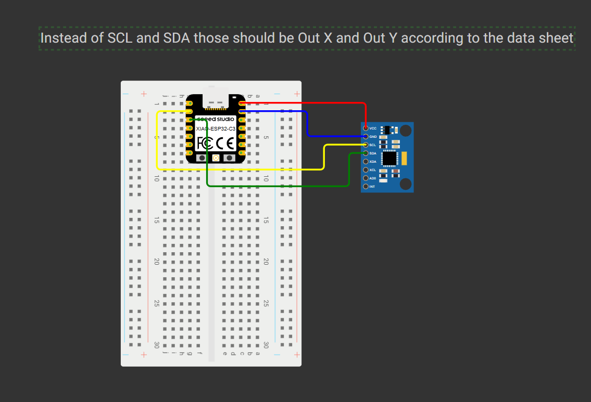
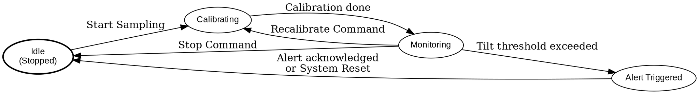

# Tilt Sensor Module (SCA121T-D03) – Vault Security System

## Overview
This module uses a 2-axis Murata SCA121T-D03 inclinometer to detect vault tilt, helping prevent physical tampering. It measures pitch/roll angles and sends alerts if thresholds are exceeded. It works with other modules (vibration, door, actuator, etc.) via a common JSON message protocol.

## Features
- **Calibration**: Sets current position as 0° pitch/roll.
- **Smoothing**: Moving average filter to reduce noise.
- **Sampling Frequency**: Adjustable, default 10Hz.
- **Tilt Sensitivity**: Trigger threshold in degrees.
- **JSON Messaging**: Interoperates with other vault modules.

## Message Protocols

### Configuration (mtype: config)
```json
{ "mtype": "config", "to": "tilt_sensor", "smoothing": 5, "frequency": 10, "threshold": 5.0 }
```

 - Calibration Command: To instruct the module to calibrate its zero position, a config message can be sent. Upon receiving this, the tilt sensor module will pause monitoring, record the current raw X/Y output as the zero offset, and then resume operation using this new baseline. The module may reply or log an acknowledgment.

 - Smoothing and Frequency: The smoothing filter strength and sampling frequency can be configured to tailor performance. A larger smoothing value yields more stable readings (less noise) at the cost of a slight delay, and the frequency setting controls how often the sensor is polled and output updated. The module would apply these settings immediately or at the next appropriate cycle and could respond with a confirmation.

 - Tilt Sensitivity (Threshold): To set the tilt angle threshold that triggers an alert, a config message is used. The term “sensitivity” in some contexts might refer to this threshold, a higher sensitivity means a lower threshold angle, detecting even small tilts. Thus, this parameter is adjustable to tune how sensitive the vault is to being tilted.

### Commands (mtype: tilt_sensor.)

Start/Stop Sampling: The tilt sensor can be instructed to start or stop its sampling loop via commands. This might be used, for example, when arming or disarming the security system. A message to start monitoring could be:

```json
{ "mtype": "tilt_sensor.start", "from": "*", "to": "tilt_sensor" }
```

This would transition the module from an idle state to active monitoring (if it wasn’t already active).

A stop command would be:

```json
{ "mtype": "tilt_sensor.stop", "from": "*", "to": "tilt_sensor" }
```

Upon receiving "stop", the module would halt further sampling and angle calculations, effectively pausing its operation. The module would likely acknowledge this by stopping any data output and perhaps sending a final status or acknowledging message.

### Output Data (mtype: data)

During normal operation, the tilt sensor module periodically sends out telemetry messages with the latest pitch and roll data. These are typically labeled with a message type such as "mtype": "data" or "mtype": "status". 

```json
{ "mtype": "data", "from": "tilt_sensor", "to": "*", "pitch": 1.2, "roll": -0.5 }
```

Telemetry messages might be sent at the configured sampling frequency (e.g. 10 Hz), or they could be sent only when there’s a significant change in angle beyond a certain delta.

### Alerts & Errors

The tilt sensor will emit an alert message if it detects a condition that meets its alert criteria. Alert messages are a special type of output meant to signal abnormal or alarm conditions to the rest of the system.

```json
{ "mtype": "alert", "from": "tilt_sensor", "to": "*", "event": "tilt_threshold_exceeded", "pitch": 12.0 }
{ "mtype": "error", "from": "tilt_sensor", "to": "*", "error": "calibration_failed" }
```

 The tilt sensor can also alert about calibration failure, if a calibration was attempted while the vault was not steady (perhaps someone was moving the vault during the calibration command), the module might detect unstable readings and issue an error like 

 ```json
 {"mtype":"error", "from":"tilt_sensor1", "to": "*", "error":"calibration_failed", "reason":"unstable"}.
 ```

Additionally the sensor can also send other errors; malformed_json, missing_required_fields, invalid_config, unknown_config_name, config_failed

### Hardware Connections

The Murata SCA121T-D03 inclinometer comes in a module form with a 5-wire interface. Proper hardware connection and mounting are crucial to ensure accurate tilt sensing and reliable operation. Below is an overview of the connections and mounting guidelines: Wiring the Tilt Sensor: The SCA121T-D03 module has five colored wires, each with a specific function, as detailed in the datasheet:

| Wire | Function         |
|------|------------------|
| Red  | Vdd (+5V)        |
| Blue | GND              |
| Yellow | X-axis output |
| Green  | Y-axis output |
| White  | Not used       |

 - Power and Ground: Connect the Red wire to a stable +5 V supply and the Blue wire to ground. Ground must be common with the microcontroller’s ground to ensure the analog readings have the correct reference. Note 5v is too low for the sensor but functionality is still mostly there.
 - Analog Outputs: Connect the Yellow (Out X) and Green (Out Y) wires to two analog input pins of the module’s microcontroller. These correspond to the X-axis and Y-axis tilt signals respectively. Yellow could go to analog input A0 and Green to A1. The microcontroller will sample these voltages to determine the tilt angles. Each analog output will be around 2.5 V when the vault is perfectly level. If the vault is tilted along the X-axis, the Yellow wire’s voltage will rise above or fall below 2.5 V proportionally; similarly, tilting along Y affects the Green wire’s voltage. At the maximum tilt of about 30°, the outputs swing to roughly 0.5 V or 4.5 V at extremes.



### Module Functionality (`tilt_sensor.ino`)

The `tilt_sensor.ino` sketch implements the full embedded module logic for the SCA121T-D03 tilt sensor. Its primary functions are:

1.  **Initialization (`setup()`):**
    *   Initializes Serial communication at 115200 baud for JSON messaging and debugging.
    *   Configures Arduino analog pins A0 (X-axis) and A1 (Y-axis) as inputs.
    *   Sets the ADC resolution to 10 bits (0-1023).
    *   Sets default configuration values for smoothing samples (`g_smoothing_window_samples`), sampling frequency (`g_sampling_freq_hz`), and tilt threshold (`g_tilt_threshold_deg`).
    *   **Automatic Initial Calibration & Monitoring Start:** Attempts to perform an initial sensor calibration (`calibrate_sensor()`). If successful, it initializes the smoothing filter with the new offsets and transitions the module to an active `SS_MONITORING` state by calling `start_module_monitoring(true, "*")`. If initial calibration fails, the module remains in an `SS_IDLE` state.

2.  **Main Loop (`loop()`):**
    *   **JSON Message Handling:** Continuously checks for incoming JSON messages on the Serial port.
        *   Validates incoming messages for proper JSON structure and required fields (`mtype`, `from`, `to`).
        *   Processes messages addressed to this module (`"tilt_sensor"` or `"*"`).
        *   Routes `config` messages to `handle_config_message()` for parameter updates (smoothing, frequency, threshold) or to trigger recalibration.
        *   Handles `tilt_sensor.start` and `tilt_sensor.stop` commands to control the monitoring state.
        *   Sends appropriate JSON responses (`status`, `error`) for commands and configurations.
    *   **Sensor Data Acquisition and Processing (if `g_monitoring_active` and `g_current_sensor_state == SS_MONITORING`):**
        *   **Non-Blocking Sampling:** Uses `millis()` for timing to take sensor readings at the interval defined by `g_sample_interval_ms` (derived from `g_sampling_freq_hz`).
        *   **Data Acquisition:** Reads raw analog ADC values from the X and Y axes using `get_raw_tilt_values_adc()`.
        *   **Smoothing:** Applies a moving average filter (`apply_smoothing_filter()`) to the raw ADC readings. The window size (`g_smoothing_window_samples`) is configurable.
        *   **Angle Conversion:** Converts the smoothed ADC values into pitch (X-axis) and roll (Y-axis) angles in degrees (`convert_adc_to_degrees()`) using the `arcsin` method.
        *   **Data Output:** Sends a `data` JSON message containing the current pitch and roll at each sampling interval.
        *   **Tilt Alert Logic:** Checks if the absolute pitch or roll exceeds the configured `g_tilt_threshold_deg`.
            *   If the threshold is exceeded and an alert for the current continuous tilt event hasn't already been sent, an `alert` JSON message (`event: "tilt_threshold_exceeded"`) is transmitted.
            *   A flag (`g_alert_sent_for_current_tilt`) prevents spamming alerts for the same tilt event. This flag is reset when the tilt returns within the threshold.

3.  **State Management:**
    *   The module operates in several states (`SensorState: SS_IDLE, SS_CALIBRATING, SS_MONITORING`) managed by `g_current_sensor_state`.
    *   A boolean `g_monitoring_active` controls whether the sensor sampling loop is active.
    *   Commands and calibration routines transition the module between these states appropriately.

4.  **Error Handling:**
    *   Sends `error` JSON messages for various conditions, including:
        *   Malformed incoming JSON.
        *   Missing required fields in JSON messages.
        *   Invalid configuration parameters or values.
        *   Calibration failures (e.g., unstable readings).

---

### Challenges / Pitfalls / Issues Encountered

1.  **Supply Voltage Mismatch (SCA121T-D03 characteristics at 5V):**
    *   The SCA121T-D03 sensor datasheet specifies a supply voltage of 7-35V. The sensor (or its characteristics emulated in this project) was effectively powered using the Xiao's 5V output.
    *   **Impact:** Operating the sensor outside its specified voltage range can lead to deviations in performance from the datasheet's nominal values (e.g., the actual 0g offset voltage and sensitivity at 5V might differ).
    *   **Mitigation in `tilt_sensor.ino`:** The software calibration routine (`calibrate_sensor()`) is critical. This routine measures the sensor's output at 0° under the actual 5V operating conditions to establish an accurate baseline for subsequent angle calculations.
    *   **Known Limitation:** Despite software calibration, operating at 5V results in a limited positive angular measurement range. The sensor can typically measure the full negative range (e.g., down to -90°) but the positive range is capped (e.g., around +38.3°). This is due to the analog output voltage not being able to reach its expected maximum with the lower supply voltage.

2.  **Angle Conversion Scaling and Full Range (Addressed):**
    *   **Initial Issue (in demo sketch):** The initial angle calculations in earlier demonstration code did not achieve the full potential ±90° range, partly due to linear approximations or incorrect scaling.
    *   **Resolution in `tilt_sensor.ino`:**
        *   The module implements the recommended `arcsin` conversion method: `α = arcsin((Vout - Offset) / Sensitivity_V_per_g)`.
        *   It uses the correct sensitivity for the SCA121T-D03 model (2.0 V/g) with this formula.
        *   The `Offset` in the formula refers to the *calibrated* offset ADC value converted to voltage, accurately reflecting the 5V operating conditions.
    *   **Note:** While the conversion formula is correct for the full range, the actual measurable range is still impacted by the "Supply Voltage Mismatch" issue mentioned above, particularly on the positive side.

3.  **`asin()` Domain Errors (NaN Results - Addressed):**
    *   **Issue:** The `asin()` function can return `NaN` (Not a Number) if its input argument is outside the valid range of \[-1.0, 1.0].
    *   **Cause:** Sensor noise or slight inaccuracies at the extremes of the measurement range could cause the calculated `(Voltage_Deviation_from_Calibrated_Zero / Sensor_Sensitivity_V_per_g)` to slightly exceed ±1.0.
    *   **Mitigation in `tilt_sensor.ino`:** The input argument to `asin()` is explicitly clamped to be strictly within \[-1.0, 1.0] using `constrain(value, -1.0, 1.0)` before calling the function, preventing `NaN` results.

4.  **Importance of Datasheet:**
    *   A recurring theme during development was the critical importance of consulting the correct datasheet for the specific sensor model (or the model whose characteristics are being emulated, like the SCA121T-D03). The datasheet provides crucial information such as measuring range, sensitivity values, and the recommended angle conversion formula.

5.  **Smoothing Filter Initialization:**
    *   **Consideration:** Ensuring the smoothing filter buffers are correctly initialized is important, especially after calibration or changes to the smoothing window size, to avoid using stale data.
    *   **Implementation in `tilt_sensor.ino`:** The `reset_smoothing_filter()` function pre-fills the filter's internal buffers with the current calibrated offset ADC values. This ensures that the filter starts with stable, "zeroed" readings immediately after calibration or when the smoothing window size is changed, providing consistent output from the outset.


## Software Design
- Reads analog X/Y, subtracts calibration offset.
- Applies smoothing filter.
- Converts to degrees using arcsin or linear approx.
- Compares to threshold, sends alert if exceeded.
- Responds to config/command JSON messages.

### UML State Summary

Inside assets there is a UML diagram that shows the state machine.

```
Idle -> Calibrating: on “start with calibration” (either assumed on every start or a specific calibrate command).
Calibrating -> Monitoring: after calibration routine finishes (or immediately if no calibration needed).
Monitoring -> Alert (logical state): when tilt crosses threshold.
Monitoring -> Idle: on “stop” command.
Alert -> Idle: possibly when the system is disarmed or alert acknowledged (this could simply be achieved by sending a stop or by clearing flags).
Monitoring -> Calibrating: if a recalibration command comes while active (the module might pause monitoring for a moment to recalibrate then continue).
```



### Test Cases
## Test Cases

### Configuration Tests

*   Document every configuration parameter test case.
*   Include the exact JSON messages to be sent.
*   Specify the expected behavior and/or response for each test, including any output messages (even if they are DEBUG messages).

#### Example Configuration Test Cases:

1.  **Test Case ID:** `T-CONFIG-01`
    *   **Description:** Verifies successful configuration of the smoothing window size (`number_sample`) to a valid value.
    *   **Input Message:**
        ```json
        {"mtype":"config", "from":"tester", "to":"tilt_sensor1", "name":"number_sample", "value":7}
        ```
    *   **Expected Output/Behavior ("Oracle"):**
        *   Module updates `g_smoothing_window_samples` to 7.
        *   Module calls `reset_smoothing_filter()`.
        *   Module sends a JSON response:
            ```json
            {"mtype":"status", "from":"tilt_sensor1", "to":"tester", "status":"config_updated", "parameter":{"name":"number_sample", "value":7}, "message":"applied"}
            ```
        *   Subsequent `data` messages should reflect the new smoothing level.
    *   **Preconditions:** Module is powered on.

2.  **Test Case ID:** `T-CONFIG-02`
    *   **Description:** Verifies rejection of an out-of-range value for `number_sample`.
    *   **Input Message:**
        ```json
        {"mtype":"config", "from":"tester", "to":"tilt_sensor1", "name":"number_sample", "value":30}
        ```
    *   **Expected Output/Behavior ("Oracle"):**
        *   Module does NOT update `g_smoothing_window_samples`.
        *   Module sends a JSON response:
            ```json
            {"mtype":"error", "from":"tilt_sensor", "to":"tester", "error":"config_failed", "parameter_info":{"name":"number_sample"}, "reason":"value_out_of_range"}
            ```
    *   **Preconditions:** Module is powered on. `MAX_SMOOTHING_SAMPLES` is less than 30 (e.g., 20).

3.  **Test Case ID:** `T-CONFIG-03`
    *   **Description:** Verifies successful configuration of sampling frequency (`frequency_hz`).
    *   **Input Message:**
        ```json
        {"mtype":"config", "from":"tester", "to":"tilt_sensor1", "name":"frequency_hz", "value":5}
        ```
    *   **Expected Output/Behavior ("Oracle"):**
        *   Module updates `g_sampling_freq_hz` to 5.
        *   Module updates `g_sample_interval_ms` to 200.
        *   Module sends a JSON response:
            ```json
            {"mtype":"status", "from":"tilt_sensor", "to":"tester", "status":"config_updated", "parameter":{"name":"frequency_hz", "value":5}, "message":"applied"}
            ```
        *   Subsequent `data` messages should be sent approximately every 200ms.
    *   **Preconditions:** Module is powered on.

4.  **Test Case ID:** `T-CONFIG-04`
    *   **Description:** Verifies successful configuration of tilt threshold (`threshold`).
    *   **Input Message:**
        ```json
        {"mtype":"config", "from":"tester", "to":"tilt_sensor1", "name":"threshold", "value":3.0}
        ```
    *   **Expected Output/Behavior ("Oracle"):**
        *   Module updates `g_tilt_threshold_deg` to 3.0.
        *   Module sends a JSON response:
            ```json
            {"mtype":"status", "from":"tilt_sensor", "to":"tester", "status":"config_updated", "parameter":{"name":"threshold", "value":3.0}, "message":"applied"}
            ```
        *   Subsequent alert logic uses this new threshold.
    *   **Preconditions:** Module is powered on.

5.  **Test Case ID:** `T-CONFIG-05`
    *   **Description:** Verifies successful initiation of sensor calibration.
    *   **Input Message:**
        ```json
        {"mtype":"config", "from":"tester", "to":"tilt_sensor1", "name":"calibrate"}
        ```
    *   **Expected Output/Behavior ("Oracle"):**
        *   Module enters `SS_CALIBRATING` state.
        *   Module performs calibration routine.
        *   Assuming stable sensor readings:
            *   Module updates `g_calib_offset_x_adc` and `g_calib_offset_y_adc`.
            *   Module calls `reset_smoothing_filter()`.
            *   Module sends a JSON response:
                ```json
                {"mtype":"status", "from":"tilt_sensor", "to":"tester", "status":"config_updated", "parameter":{"name":"calibrate", "value":0}, "message":"calibration_successful"}
                ```
            *   Module returns to `SS_IDLE` or `SS_MONITORING` state as appropriate.
    *   **Preconditions:** Module is powered on. Sensor is physically level and stable.

6.  **Test Case ID:** `T-CONFIG-06`
    *   **Description:** Verifies calibration failure due to unstable sensor readings.
    *   **Input Message:**
        ```json
        {"mtype":"config", "from":"tester", "to":"tilt_sensor1", "name":"calibrate"}
        ```
    *   **Expected Output/Behavior ("Oracle"):**
        *   Module enters `SS_CALIBRATING` state.
        *   Module performs calibration routine.
        *   Module detects unstable readings.
        *   Module sends a JSON response (example):
            ```json
            {"mtype":"error", "from":"tilt_sensor", "to":"tester", "error":"calibration_failed", "reason":"Unstable readings. X_delta: [value], Y_delta: [value]"}
            ```
        *   Module sets state to `SS_IDLE`.
    *   **Preconditions:** Module is powered on. Sensor is physically being moved or is unstable during the calibration period defined by `CALIBRATION_SAMPLES_COUNT` and `CALIBRATION_DELAY_MS`.

---

### Input Message Tests

*   Document test cases for each supported input message type (e.g., `tilt_sensor.start`, `tilt_sensor.stop`).
*   Include at least one test for normal operation and one for error handling per message type (if applicable, e.g., trying to start when already started might be normal, not an error).
*   Provide the exact JSON input messages to use for testing.
*   Specify the expected output messages or behavior, including any output messages (even if they are DEBUG messages).

#### Example Input Message Test Cases:

1.  **Test Case ID:** `T-INPUT-01`
    *   **Description:** Verifies normal operation of the `tilt_sensor.start` command when the module is idle and has been calibrated.
    *   **Input Message:**
        ```json
        {"mtype":"tilt_sensor.start", "from":"tester", "to":"tilt_sensor1"}
        ```
    *   **Expected Output/Behavior ("Oracle"):**
        *   Module sets `g_monitoring_active` to `true`.
        *   Module sets `g_current_sensor_state` to `SS_MONITORING`.
        *   Module starts sending `data` JSON messages at the configured frequency.
        *   Module sends a JSON response:
            ```json
            {"mtype":"status", "from":"tilt_sensor", "to":"tester", "status":"command_ack", "details":{"tilt_sensor.start":"monitoring_started"}}
            ```
    *   **Preconditions:** Module is powered on, in `SS_IDLE` state, and has been successfully calibrated previously (or `start_module_monitoring` will trigger calibration).

2.  **Test Case ID:** `T-INPUT-02`
    *   **Description:** Verifies the `tilt_sensor.start` command when the module is already monitoring.
    *   **Input Message:**
        ```json
        {"mtype":"tilt_sensor.start", "from":"tester", "to":"tilt_sensor1"}
        ```
    *   **Expected Output/Behavior ("Oracle"):**
        *   Module state remains `SS_MONITORING` and `g_monitoring_active` remains `true`.
        *   Module sends a JSON response:
            ```json
            {"mtype":"status", "from":"tilt_sensor", "to":"tester", "status":"command_ack", "details":{"tilt_sensor.start":"already_monitoring"}}
            ```
    *   **Preconditions:** Module is powered on and actively monitoring (`SS_MONITORING` state).

3.  **Test Case ID:** `T-INPUT-03`
    *   **Description:** Verifies normal operation of the `tilt_sensor.stop` command.
    *   **Input Message:**
        ```json
        {"mtype":"tilt_sensor.stop", "from":"tester", "to":"tilt_sensor1"}
        ```
    *   **Expected Output/Behavior ("Oracle"):**
        *   Module sets `g_monitoring_active` to `false`.
        *   Module sets `g_current_sensor_state` to `SS_IDLE`.
        *   Module stops sending `data` and `alert` messages.
        *   Module sends a JSON response:
            ```json
            {"mtype":"status", "from":"tilt_sensor", "to":"tester", "status":"command_ack", "details":{"tilt_sensor.stop":"monitoring_stopped"}}
            ```
    *   **Preconditions:** Module is powered on, can be in `SS_MONITORING` or `SS_IDLE` state.

---

### Error Handling Tests

*   Document test cases for error conditions (malformed messages, invalid parameters in non-config messages if any, etc.).
*   Include the exact input that should trigger the error.
*   Specify the expected error message or behavior.

#### Example Error Handling Test Cases:

1.  **Test Case ID:** `T-ERROR-01`
    *   **Description:** Verifies handling of a malformed JSON message (e.g., missing closing brace).
    *   **Input Message (sent over Serial):**
        ```
        {"mtype":"config", "from":"tester", "to":"tilt_sensor1", "name":"threshold", "value":5.0
        ```
    *   **Expected Output/Behavior ("Oracle"):**
        *   Module fails to parse the JSON.
        *   Module sends a JSON error response:
            ```json
            {"mtype":"error", "from":"tilt_sensor", "to":"*", "error":"malformed_json", "reason":"[specific ArduinoJson error code, e.g., IncompleteInput]"}
            ```
    *   **Preconditions:** Module is powered on.

2.  **Test Case ID:** `T-ERROR-02`
    *   **Description:** Verifies handling of a JSON message missing a required field (`mtype`).
    *   **Input Message:**
        ```json
        {"from":"tester", "to":"tilt_sensor1", "name":"threshold", "value":5.0}
        ```
    *   **Expected Output/Behavior ("Oracle"):**
        *   Module detects the missing `mtype` field.
        *   Module sends a JSON error response:
            ```json
            {"mtype":"error", "from":"tilt_sensor", "to":"tester", "error":"missing_required_fields", "reason":"mtype, from, or to missing"}
            ```
    *   **Preconditions:** Module is powered on.

3.  **Test Case ID:** `T-ERROR-03`
    *   **Description:** Verifies handling of a `config` message with an unknown parameter `name`.
    *   **Input Message:**
        ```json
        {"mtype":"config", "from":"tester", "to":"tilt_sensor1", "name":"unknown_param", "value":10}
        ```
    *   **Expected Output/Behavior ("Oracle"):**
        *   Module identifies `unknown_param` as not recognized.
        *   Module sends a JSON error response:
            ```json
            {"mtype":"error", "from":"tilt_sensor", "to":"tester", "error":"unknown_config_name", "reason":"unknown_param"}
            ```
    *   **Preconditions:** Module is powered on.

4.  **Test Case ID:** `T-ERROR-04`
    *   **Description:** Verifies that messages not addressed to "tilt_sensor" or "*" are silently ignored.
    *   **Input Message:**
        ```json
        {"mtype":"config", "from":"tester", "to":"other_module", "name":"some_name", "value":10}
        ```
    *   **Expected Output/Behavior ("Oracle"):**
        *   Module does not process the message.
        *   Module sends no JSON response.
        *   Module state remains unchanged.
    *   **Preconditions:** Module is powered on.

---

**(General Structure for Each Test Case - as per point 2 of the assignment)**

For each test case documented above (and any others you create), ensure you explicitly include:

*   **Test Case ID:** (e.g., `T-CONFIG-01`, `T-INPUT-03`)
*   **Description:** A brief description of what the test verifies.
*   **Input Message (if applicable):** The exact JSON string.
*   **Expected Output/Behavior ("Oracle"):** The expected JSON response(s) and/or changes in module state or behavior.
*   **Special Setup Requirements or Preconditions:** Any specific module state or physical setup needed before running the test.
